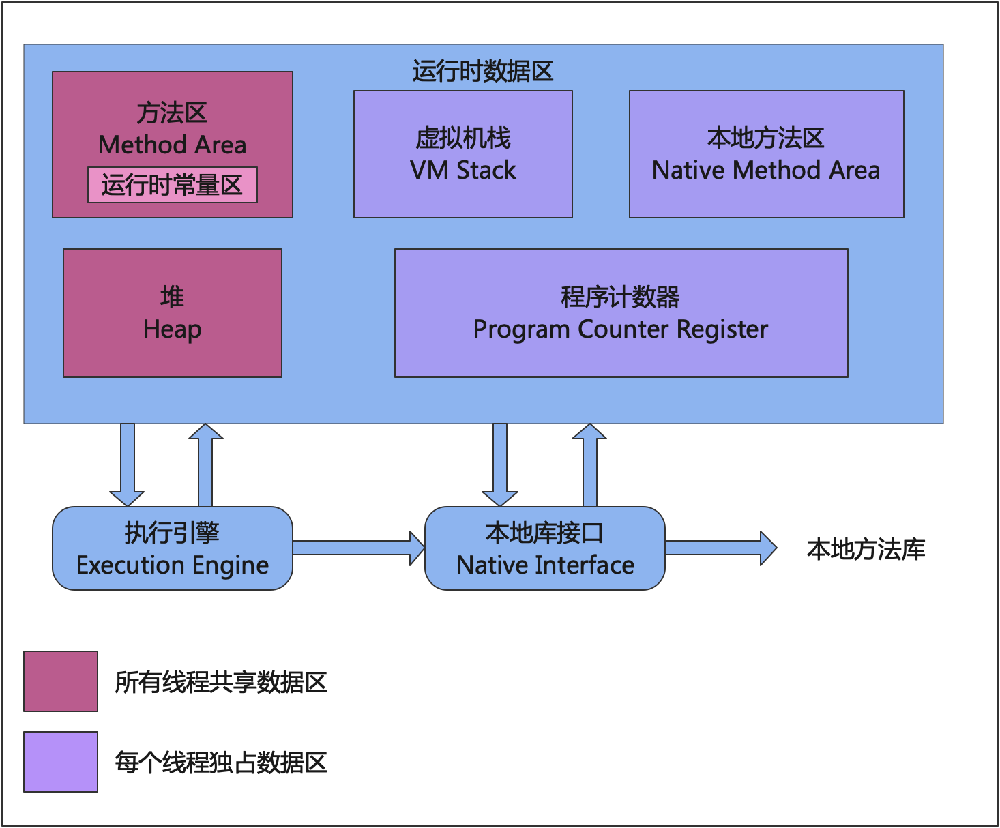

# JVM数据区域
线程独占区

##### 程序计数器
* 相当于一个执行代码的指示器，用来确认下一行执行的地址
* 每个线程都有一个
* 没有 OOM 的区

##### java虚拟机栈
* 我们平时说的栈就是这块区域
* java 虚拟机规范中定义了 OutOfMemeory , stackoverflow 异常
### 存放的基本类型的变量和对象的引用

如果线程请求的栈深度大于虚拟机所允许的深度，将抛出StackOverflowError异常；

当栈扩展时无法申请到足够的内存会抛出OutOfMemoryError异常。

##### 本地方法栈
* java 虚拟机规范中定义了 OutOfMemory ，stackoverflow 异常

本地方法栈（Native Method Stacks）与虚拟机栈所发挥的作用是非常相似的，其区别只是虚拟机栈为虚拟机执行Java方法（也就是字节码）服务，
而本地方法栈则是为虚拟机使用到的本地（Native）方法服务。

* 在 hotspotVM 中把虚拟机栈和本地方法栈合为了一个栈区

线程共享区

##### java 堆
* 虚拟机能管理的最大的一块内存 GC 主战场
* 会出现 OOM
* 对象实例
* 数据的内容

##### 方法区
* ClassLoader 加载类信息
* 常量、静态变量
* 编译后的代码
* 会出现 OOM
* 运行时常量池
   * public static final
   * 符号引用类、接口全名、方法名

方法区是一个规范，它的实现取决于不同的虚拟机。

在Java8之前，HotSpot虚拟机使用**永久代**来实现方法区。
而Java8之后，HotSpot虚拟机使用**元空间**来实现方法区。

执行引擎机制：
* 解释器：将字节码逐行解释执行。
* JIT编译器(即时编译器)：将字节码整体编译为机器码执行。

本地接口是根据本地方法栈，即java中用native标记的本地方法，会先被在本地方法栈Native Method Stack中登记，
然后会根据这个本地方法在本地接口中生成一个对应的本地接口，最后在启动执行引擎Execution Engine的时候，
会根据本地接口去本地方法库中加载对应的实现方法，然后执行这个方法。