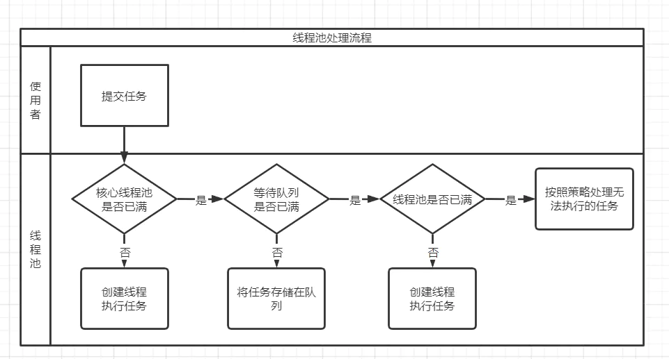
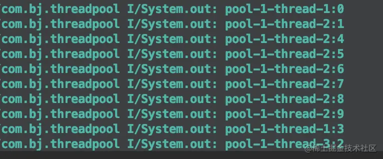
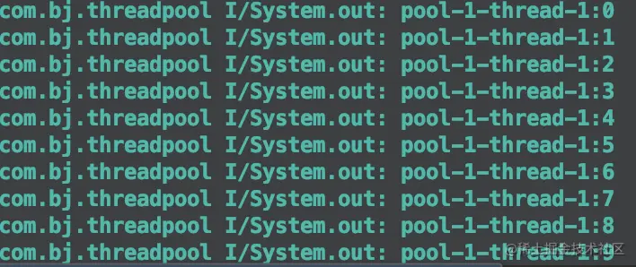
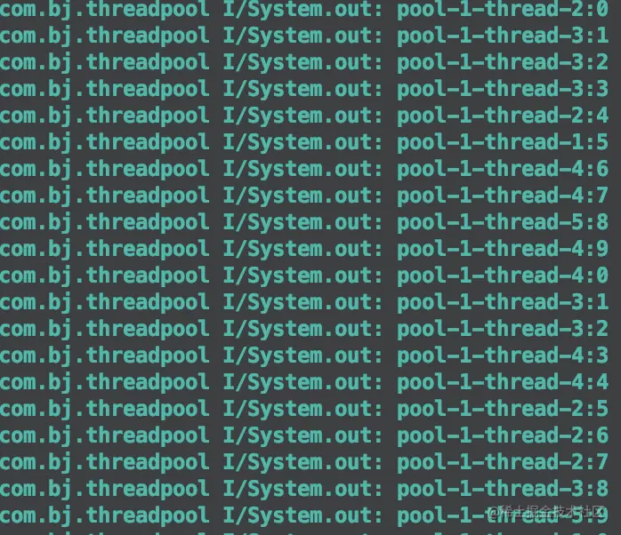

# 线程池属性说明
## 1.前言
...

## 2.为毛用它
1. **降低资源消耗**：通过它重用已存在的线程，可以有效的降低，由频繁创建和销毁线程所造成资源的消耗。
2. **增加系统稳定性**：由线程池统一管理，除了可以降低资源的消耗，还可以有效控制线程的并发数量，不会让线程无限制的创建，增加了系统的稳定性。
3. **提高了响应速度**：因为重用线程，所以提高了响应速度。  

## 3.线程池介绍
```Plain Text
public ThreadPoolExecutor(int corePoolSize,
                          int maximumPoolSize,
                          long keepAliveTime,
                          TimeUnit unit,
                          BlockingQueue<Runnable> workQueue,
                          ThreadFactory threadFactory,
                          RejectedExecutionHandler handler)

```
#### 1\. corePoolSize（最大核心线程数）：
线程池创建线程的时候，如果当前的线程总个数 < corePoolSize，那么新建的线程为核心线程，
如果当前线程总个数 >= corePoolSize，那么新建的线程为非核心线程。   
核心线程默认会一直存活下去，即便是空闲状态，但是如果设置了allowCoreThreadTimeOut(true)的话，
那么核心线程空闲时间达到keepAliveTime也将关闭。

#### 2\. maximumPoolSize（线程池能容纳的最大线程数量）：
核心线程数 + 非核心线程数 = 最大线程数量

#### 3\. keepAliveTime（线程的存活时间）：
非核心线程在空闲状态下，超过keepAliveTime时间，就会被回收，
如果核心线程设置了allowCoreThreadTimeOut(true)的话，那么在空闲时，超过keepAliveTime时间，核心线程也会被回收。

#### 4\. TimeUnit（时间单位）：
时、分、秒、毫秒等

#### 5\. BlockingQueue（缓存队列）：
当有任务到来时，会指派给核心线程去执行，等核心线程都被占用了，那么再有新的任务，
就会加入到队列中，等队列满了，再有任务，就再启动非核心线程去执行。常用的队列如下

* SynchronousQueue   使用这个队列时，当有任务到来的时候，它并不存任务，
而是直接将任务丢给线程去执行，如果线程都在被占用，它就会创建线程去处理这个任务，
所以一般使用这个缓存队列的时候，maximumPoolSize（线程池能容纳的最大线程数量）设置到 Integer.MAX_VALUE，
不然任务数超过maximumPoolSize限制而创建不了线程。
* LinkedBlockingQueue   使用这个队列是，当有任务到来的时候，如果当前的核心线程数 < corePoolSize，
它会新建核心线程去执行任务，如果当前核心线程数 >= corePoolSize时，它会将还未被执行的任务存储起来，
等待执行，但是这个队列，没有存储上限，所以尼，这也就造成了，maximumPoolSize（总线程数），
永远不会超过corePoolSize。此队列按 FIFO（先进先出）原则对任务进行操作。
* ArrayBlockingQueue   使用这个队列尼，可以设置队列的长度，那么当任务到来的时候，
核心线程数 < corePoolSize时, 则创建核心线程去执行任务，如果核心线程数 >= corePoolSize时，
加入到队列里面，等待执行，如果队列也满了，则新建非核心线程去执行任务。此队列按 FIFO（先进先出）原则对元素进行操作。但是线程数不能超过总线程数。
* DelayQueue（延时队列）   任务到来时，首先先加入到队列中，只有达到了指定的延时时间，才会执行任务。

##### 5\. ThreadFactory（线程工厂）：
用来创建线程池中的线程，用默认的即可。

#### 6\. RejectedExecutionHandler（拒绝策略）：
当任务过多时，即：当前线程数已经达到了最大线程数，缓冲队列也已经满了，或者线程池关闭了，那么再来的任务请求，
我们会拒绝，怎么拒绝尼？有以下几个方案：

* **AbortPolicy（默认策略）**

默认策略，简单粗暴，直接拒绝抛异常（RejectedExecutionException）

* **DiscardPolicy**

DiscardPolicy策略就是，直接丢弃，但是不抛异常。如果线程队列已满，则后续提交的任务都会被丢弃。

* **DiscardOldestPolicy**

DiscardOldestPolicy策略就是，直接丢弃掉队伍最前面的任务，再重新提交后面新来的任务。

* **CallerRunsPolicy**

CallerRunsPolicy策略就是不抛弃任务，由调用者运行这个任务，比如主线程启动了线程池去运行这个任务，
现在线程池满了，那么这个任务就由主线程进行调用执行了。

**总结一下** 让任务到来的时候，会执行以下的流程

1. 线程数量未达到 corePoolSize，则新建一个线程（核心线程）执行任务。
2. 线程数量达到了 corePoolsSize，则将任务移入队列等待。
3. 队列已满，新建非核心线程（先进先出）执行任务。
4. 队列已满，总线程数又达到了 maximumPoolSize，就会由 RejectedExecutionHandler 抛出异常。



明白了吗？如果你不想自己写一个线程池，有更简单的方式，就是系统已经为我们定义好了几个线程池，下面介绍下他们的使用，看看有没有符合你要求的。

## 4.常用的线程池
看下图


## 5.代码
#### 1\. FixedThreadPool
创建一个定长的线程池，可控制线程最大的并发数，超出的部分任务，会在队列中等待，适用于：
已知并发压力的情况下，对线程数做限制。实际上就是只使用核心线程。

```Plain Text
 private void testFiexdThreadPool() {

        ExecutorService threadPool = Executors.newFixedThreadPool(3);

        for (int n = 0; n < 10; n++){

            final int finalN = n;
            threadPool.execute(new Runnable() {

                @Override
                public void run() {

                    System.out.println(Thread.currentThread().getName()+":"+ finalN);
                }
            });
        }
    }

```
结果



#### 2\. SingleThreadExecutor
创建一个单线程化的线程池，它只会用唯一的工作线程来执行任务，保证所有任务按照指定顺序(FIFO, LIFO, 优先级)执行。

```Plain Text
private void testSingleThreadExecutor(){

    ExecutorService threadPool = Executors.newSingleThreadExecutor();
    for (int n = 0; n < 10; n++){

        final int finalN = n;
        threadPool.execute(new Runnable() {

            @Override
            public void run() {

                System.out.println(Thread.currentThread().getName()+":"+ finalN);
            }
        });
    }
}

```
结果



#### 3\. CachedThreadPool
创建一个可缓存线程池，如果线程池长度超过处理需要，可灵活回收空闲线程，若无可回收，则新建线程。

```Plain Text
 private void testCachedThreadPool(){

    ExecutorService threadPool = Executors.newCachedThreadPool();

    for (int n = 0; n < 10; n++){

        final int finalN = n;
        threadPool.execute(new Runnable() {

            @Override
            public void run() {

                System.out.println(Thread.currentThread().getName()+":"+ finalN);
            }
        });
    }
}

```
结果


#### 4\. ScheduledThreadPool
创建一个可定期或者延时执行任务的定长线程池，支持定时及周期性任务执行。

```Plain Text
private void testScheduledThreadPool(){

    ScheduledExecutorService threadPool = Executors.newScheduledThreadPool(5);

    for (int n = 0; n < 10; n++){

        final int finalN = n;
        threadPool.scheduleAtFixedRate(new Runnable() {

            @Override
            public void run() {

                System.out.println(Thread.currentThread().getName()+":"+ finalN);
            }
        }, 3, 2, TimeUnit.SECONDS);
    }
}

```
结果




