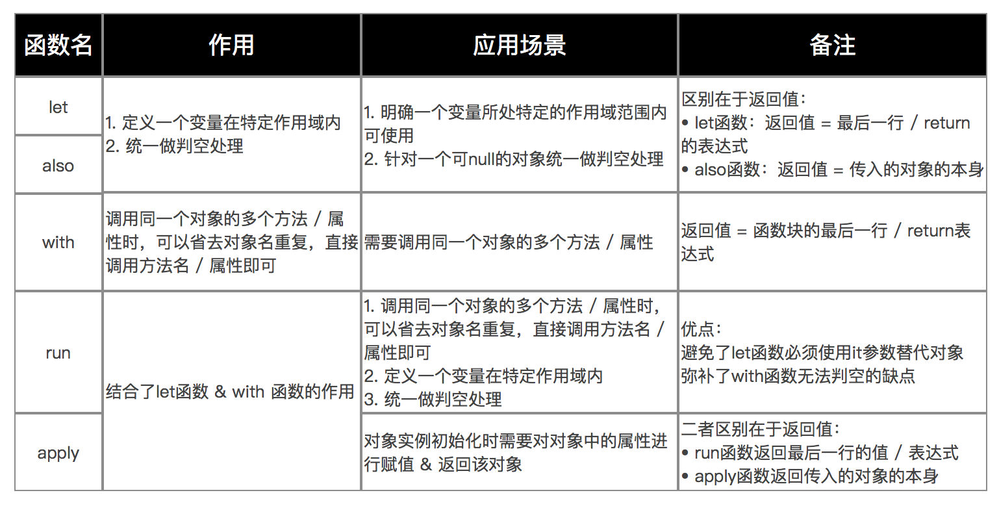

#### let
```
// 使用kotlin（无使用let函数）
mVar?.function1()
mVar?.function2()
mVar?.function3()

// 使用kotlin（使用let函数）
// 方便了统一判空的处理 & 确定了mVar变量的作用域
mVar?.let {
       it.function1()
       it.function2()
       it.function3()
}
```

#### also
```
// let函数
var result = mVar.let {
               it.function1()
               it.function2()
               it.function3()
               999
}
// 最终结果 = 返回999给变量result

// also函数
var result = mVar.also {
               it.function1()
               it.function2()
               it.function3()
               999
}
// 最终结果 = 返回一个mVar对象给变量result
```

#### with
```
// kotlin
val people = People("carson", 25)
with(people) {
println("my name is $name, I am $age years old")
}
```

#### apply
