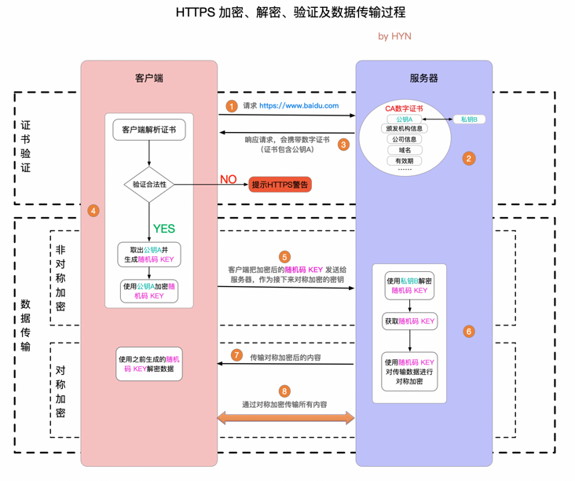

# 网络加密

### 对称加密(Symmetric Cryptography)
加密，解密使用同一个密钥
AES
对称加密的优缺点：

* 优点：计算量小，速度快，效率高
* 缺点：密钥配送问题

RSA
### 非对称加密(ASymmetric Cryptography)
* 非对称加密的优缺点：
* 优点：解决密钥配送问题，分公私钥，安全性高
* 缺点：加解密速度慢

补充：
公钥对数据加密，必须使用私钥解密
私钥对数据加密，必须使用公钥解密
私钥加密的应用场景：数字签名

### 混合加密(Hybrid Cryptography)
为了结合对称加密速度快和非对称加密安全性高的优点，同时规避两者缺点，产出的方案

* 发送者用非对称加密的公钥对对称加密的密钥加密
* 用对称密钥对消息进行加密
* 接收者用私钥解密获得对称加密的密钥，来解密消息

### 中间人攻击
1. 某网站有用于非对称加密的公钥A、私钥A’。
2. 浏览器向网站服务器请求，服务器把公钥A明文给传输浏览器。
3. 中间人劫持到公钥A，保存下来，把数据包中的公钥A替换成自己伪造的公钥B（它当然也拥有公钥B对应的私钥B’）。
4. 浏览器生成一个用于对称加密的密钥X，用公钥B（浏览器无法得知公钥被替换了）加密后传给服务器。
5. 中间人劫持后用私钥B’解密得到密钥X，再用公钥A加密后传给服务器。
6. 服务器拿到后用私钥A’解密得到密钥X。

### 数字证书
网站在使用HTTPS前，需要向CA机构申领一份数字证书，数字证书里含有证书持有者信息、公钥信息等。
服务器把证书传输给浏览器，浏览器从证书里获取公钥就行了，证书就如身份证，证明“该公钥对应该网站”。
而这里又有一个显而易见的问题，“证书本身的传输过程中，如何防止被篡改”？即如何证明证书本身的真实性？身份证运用了一些防伪技术，
而数字证书怎么防伪呢？解决这个问题我们就接近胜利了！

数字签名的制作过程：

1. CA机构拥有非对称加密的私钥和公钥。
2. CA机构对证书明文数据T进行hash。
3. 对hash后的值用私钥加密，得到数字签名S。
明文和数字签名共同组成了数字证书，这样一份数字证书就可以颁发给网站了。

### 每次进行HTTPS请求时都必须在SSL/TLS层进行握手传输密钥吗？
这也是我当时的困惑之一，显然每次请求都经历一次密钥传输过程非常耗时，那怎么达到只传输一次呢？

服务器会为每个浏览器（或客户端软件）维护一个session ID，在TLS握手阶段传给浏览器，浏览器生成好密钥传给服务器后，
服务器会把该密钥存到相应的session ID下，之后浏览器每次请求都会携带session ID，服务器会根据session ID找到相应的密钥并进行解密加密操作，
这样就不必要每次重新制作、传输密钥了！

