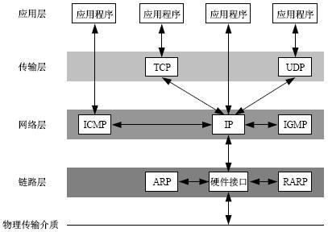
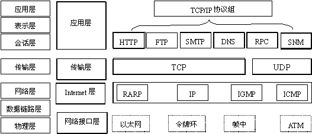
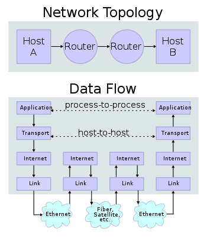
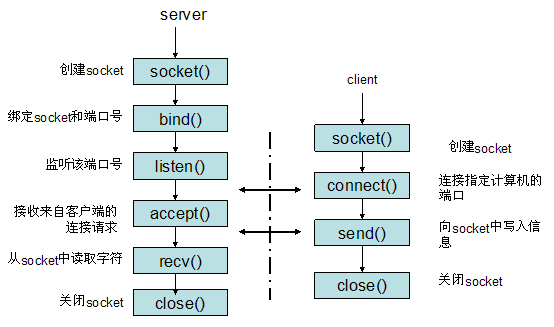
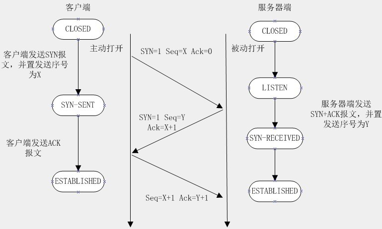
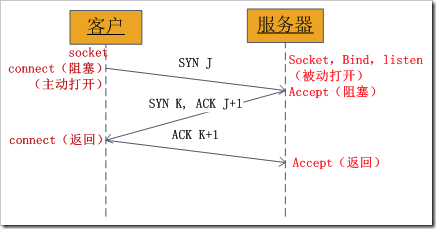

# socket编程浅析
### 题外话
前几天和朋友聊天，朋友问我怎么最近不写博客了，一个是因为最近在忙着公司使用的一些控件的开发，
浏览器兼容性搞死人；但主要是因为这段时间一直在 看html5的东西，看到web socket时觉得很有意思，动手写几个demo，
但web socket需要特定的服务器支持，由于标准制定工作还没完成，所以没有多少主流的服务器支持，
自己在网上下载了几个实现，包括php的、C#的、甚至 Node.js的，但一个是协议变化比较大，很多代码已经过时了，
再就是有一些支持最新的标准，但是我想稍微改造一下，看人家源代码的时候云里雾里，看看 别人的代码行数也不多，决定自己实现一个。

悲剧由此开始，虽然哥们儿国内非知名工科大学毕业，但好歹也是科班CS出身，但大学得过且过，
什么TCP/IP协议，什么socket了都没概念。 为了做出一个简单的支持广播的websocket server，
在网上找了很多相关代码，左抄一句，右抄一句，弄了一个星期竟然还是漏洞百出，调试不起来，只好从头来过了，
先补一些基本知识，然后再一步 步根据原理实现，今天终于实现了绝大部分功能，
由此真的感受到了，搞计算机必须得有理论指导实践，否则只能像个没头苍蝇到处乱撞。

### TCP/IP
要想理解socket首先得熟悉一下TCP/IP协议族，TCP/IP（Transmission Control Protocol/Internet Protocol）即传输控制协议/网间协议，
定义了主机如何连入因特网及数据如何再它们之间传输的标准，

从字面意思来看TCP/IP是TCP和IP协议的合称，但实际上TCP/IP协议是指因特网整个TCP/IP协议族。
不同于ISO模型的七个分层，TCP/IP协议参考模型把所有的TCP/IP系列协议归类到四个抽象层中

应用层：TFTP，HTTP，SNMP，FTP，SMTP，DNS，Telnet 等等

传输层：TCP，UDP

网络层：IP，ICMP，OSPF，EIGRP，IGMP

数据链路层：SLIP，CSLIP，PPP，MTU

每一抽象层建立在低一层提供的服务上，并且为高一层提供服务，看起来大概是这样子的





估计有兴趣打开此文的同学都对此有一定了解了，加上我也是一知半解，所以就不详细解释，有兴趣同学可以上网上搜一下资料

[维基百科](http://zh.wikipedia.org/wiki/TCP/IP "TCP/IP协议")[  ](http://zh.wikipedia.org/wiki/TCP/IP "维基百科")

[百度百科](http://baike.baidu.com/link?url=KJleEWJUBxe3XaxEaTU1lcQrg9qYN7FYzuPhoWVyoPFNk79NIURxAO6HSWC1MfrCU1Dh7QRsNDWOaZ-4bg5HRa "TCP/IP协议")

在TCP/IP协议中两个因特网主机通过两个路由器和对应的层连接。各主机上的应用通过一些数据通道相互执行读取操作



### socket
我们知道两个进程如果需要进行通讯最基本的一个前提能能够唯一的标示一个进程，
在本地进程通讯中我们可以使用PID来唯一标示一个进程，但PID只 在本地唯一，网络中的两个进程PID冲突几率很大，
这时候我们需要另辟它径了，我们知道IP层的ip地址可以唯一标示主机，而TCP层协议和端口号可以唯 一标示主机的一个进程，
这样我们可以利用ip地址＋协议＋端口号唯一标示网络中的一个进程。

能够唯一标示网络中的进程后，它们就可以利用socket进行通信了，什么是socket呢？
我们经常把socket翻译为套接字，socket是在应用层和传输层之间的一个抽象层，
它把TCP/IP层复杂的操作抽象为几个简单的接口供应用层调用已实现进程在网络中通信。


socket起源于UNIX，在Unix一切皆文件哲学的思想下，socket是一种"打开—读/写—关闭"模式的实现，
服务器和客户端各自维护一个"文件"，在建立连接打开后，可以向自己文件写入内容供对方读取或者读取对方内容，通讯结束时关闭文件。

### socket通信流程
socket是"打开—读/写—关闭"模式的实现，以使用TCP协议通讯的socket为例，其交互流程大概是这样子的



服务器根据地址类型（ipv4,ipv6）、socket类型、协议创建socket

服务器为socket绑定ip地址和端口号

服务器socket监听端口号请求，随时准备接收客户端发来的连接，这时候服务器的socket并没有被打开

客户端创建socket

客户端打开socket，根据服务器ip地址和端口号试图连接服务器socket

服务器socket接收到客户端socket请求，被动打开，开始接收客户端请求，直到客户端返回连接信息。
这时候socket进入**阻塞**状态，所谓阻塞即accept()方法一直到客户端返回连接信息后才返回，开始接收下一个客户端谅解请求

客户端连接成功，向服务器发送连接状态信息

服务器accept方法返回，连接成功

客户端向socket写入信息

服务器读取信息

客户端关闭

服务器端关闭

### 三次握手
在TCP/IP协议中，TCP协议通过三次握手建立一个可靠的连接



第一次握手：客户端尝试连接服务器，向服务器发送syn包（同步序列编号_**Synchronize Sequence Numbers**_），
syn=j，客户端进入SYN_SEND状态等待服务器确认

第二次握手：服务器接收客户端syn包并确认（ack=j+1），同时向客户端发送一个SYN包（syn=k），即SYN+ACK包，此时服务器进入SYN_RECV状态

第三次握手：第三次握手：客户端收到服务器的SYN+ACK包，向服务器发送确认包ACK(ack=k+1），此包发送完毕，
客户端和服务器进入ESTABLISHED状态，完成三次握手

定睛一看，服务器socket与客户端socket建立连接的部分其实就是大名鼎鼎的三次握手



**socket编程API**

前面提到socket是"打开—读/写—关闭"模式的实现，简单了解一下socket提供了哪些API供应用程序使用，
还是以TCP协议为例，看看 Unix下的socket API，其它语言都很类似（PHP甚至名字都几乎一样），
这里我就简单解释一下方法作用和参数，具体使用有兴趣同学可以看看博客参考中的链接或者上网搜索

```Plain Text
int socket(int domain, int type, int protocol);
```
根据指定的地址族、数据类型和协议来分配一个socket的描述字及其所用的资源。

domain:协议族，常用的有AF_INET、AF_INET6、AF_LOCAL、AF_ROUTE其中AF_INET代表使用ipv4地址

type:socket类型，常用的socket类型有，SOCK_STREAM、SOCK_DGRAM、SOCK_RAW、SOCK_PACKET、SOCK_SEQPACKET等

protocol:协议。常用的协议有，IPPROTO_TCP、IPPTOTO_UDP、IPPROTO_SCTP、IPPROTO_TIPC等

```Plain Text
int bind(int sockfd, const struct sockaddr *addr, socklen_t addrlen);
```
把一个地址族中的特定地址赋给socket

sockfd:socket描述字，也就是socket引用

addr:要绑定给sockfd的协议地址

addrlen:地址的长度

*通常服务器在启动的时候都会绑定一个众所周知的地址（如ip地址+端口号），用于提供服务，
客户就可以通过它来接连服务器；而客户端就不用 指定，有系统自动分配一个端口号和自身的ip地址组合。
这就是为什么通常服务器端在listen之前会调用bind()，而客户端就不会调用，而是在 connect()时由系统随机生成一个。*

```Plain Text
int listen(int sockfd, int backlog);
```
监听socket

sockfd:要监听的socket描述字

backlog:相应socket可以排队的最大连接个数

```Plain Text
int connect(int sockfd, const struct sockaddr *addr, socklen_t addrlen);
```
连接某个socket

sockfd:客户端的socket描述字

addr:服务器的socket地址

addrlen:socket地址的长度

```Plain Text
int accept(int sockfd, struct sockaddr *addr, socklen_t *addrlen);
```
TCP服务器监听到客户端请求之后，调用accept()函数取接收请求

sockfd:服务器的socket描述字

addr:客户端的socket地址

addrlen:socket地址的长度

```Plain Text
ssize_t read(int fd, void *buf, size_t count);
```
读取socket内容

fd:socket描述字

buf：缓冲区

count：缓冲区长度

```Plain Text
ssize_t write(int fd, const void *buf, size_t count);
```
向socket写入内容，其实就是发送内容

fd:socket描述字

buf：缓冲区

count：缓冲区长度

```Plain Text
int close(int fd);
```
socket标记为以关闭 ，使相应socket描述字的引用计数-1，当引用计数为0的时候，触发TCP客户端向服务器发送终止连接请求。

### 参考
[Linux Socket编程（不限Linux）](http://www.cnblogs.com/skynet/archive/2010/12/12/1903949.html)

[揭开Socket编程的面纱  ](http://goodcandle.cnblogs.com/archive/2005/12/10/294652.aspx)

PS. 有同学看完后发现没有demo示例，参考中的示例已经很不错了，我就不班门弄斧了，而且我用C#实现了一个websocket server，
接下来的博客中会有介绍。另外由于刚刚实际接触socket，文中谬误较多，还望大家批评指正，
文章内容主要参考上面两个博文，图片全部来 源于网络，在百度图片搜索得来，无法注明第一源地址，如有版权问题请站内信联系，第一时间处理。
