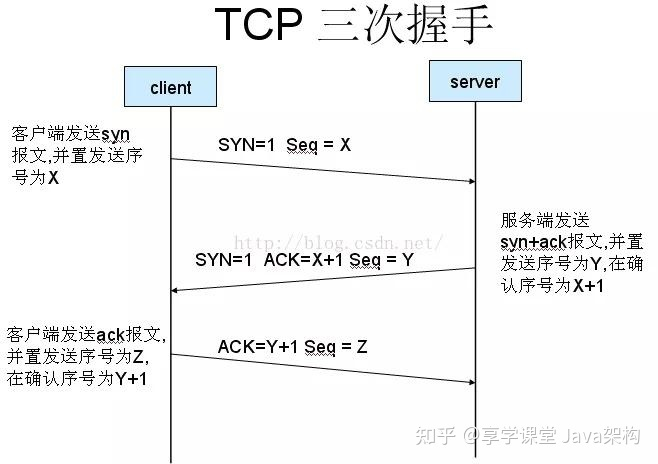
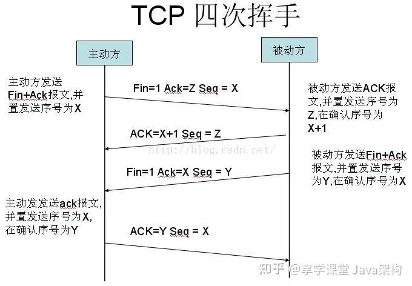
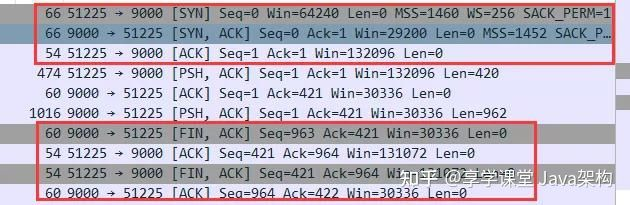

# 三次握手四次分手
TCP/IP协议定义了计算机在网络中如何发送数据、数据格式如何定义、发出消息后在网络中如何寻址找到目标计算机，
最后目标计算机又如何检验收到消息的正确性、对数据拆解最后得到消息内容的一套处理标准。
有了这些标准后生产提供TCP/IP服务的软件商家就有了一套统一的规范，只要遵循这个规范去实现自己的软件功能。

### 三次握手
在进行业务通信前，必须建立好连接，而TCP/IP连接的建立需要经过三次握手的过程。其过程如下图：

第一次握手：建立连接时，客户端发送syn包（syn=j）到服务器，并进入SYN_SENT状态，等待服务器确认；
SYN：同步序列编号（Synchronize Sequence Numbers）。
第二次握手：服务器收到syn包，必须确认客户的SYN（ack=j+1），同时自己也发送一个SYN包（syn=k），即SYN+ACK包，此时服务器进入SYN_RECV状态；
第三次握手：客户端收到服务器的SYN+ACK包，向服务器发送确认包ACK(ack=k+1），此包发送完毕，
客户端和服务器进入ESTABLISHED（TCP连接成功）状态，完成三次握手。

### 为什么要三次握手？
三次握手的意义在于确定双方都能够完成读写操作。
第一次握手，客户端发了个连接请求消息到服务端，服务端收到信息后知道自己与客户端是可以连接成功的，
但此时客户端并不知道服务端是否已经接收到了它的请求，所以服务端接收到消息后的应答。
客户端得到服务端的反馈后，才确定自己与服务端是可以连接上的，这就是第二次握手。
而服务端发送出去的消息，要等客户端响应后，才能确定此次连接为有效连接。

否则假设：
客户端发出去的第一个连接请求由于某些原因在网络节点中滞留了导致延迟，直到连接释放的某个时间点才到达服务端，
这是一个早已失效的报文，但是此时服务端仍然认为这是客户端的建立连接请求第一次握手，
于是服务端回应了客户端，第二次握手。如果没有第三次握手，那么到这里，连接就建立了，
但是此时客户端并没有任何数据要发送，会让服务端空等，造成资源浪费。

### 四次挥手
在完成数据交互之后，如果选择关闭连接，以回收资源，则完成四次挥手来进行“和平分手”。过程如下图：

第一次挥手：主动关闭方发送第一个包，其中FIN标志位为1，发送顺序号seq为X。
第二次挥手：被动关闭方收到FIN包后发送第二个包，其中发送顺序号seq为Z，接收顺序号ack为X+1。
第三次挥手：被动关闭方再发送第三个包，其中FIN标志位为1，发送顺序号seq为Y，接收顺序号ack为X。
第四次挥手：主动关闭方发送第四个包，其中发送顺序号为X，接收顺序号为Y。至此，完成四次挥手。

    这边第二次挥手第三次可以合成一次，总共三次分手
### 为什么断开连接需要四次挥手？
三次握手是因为建立连接时，ACK和SYN可以放在一个报文里来发送。而关闭连接时，被动关闭方可能还需要发送一些数据后，
再发送FIN报文表示同意现在可以关闭连接了，所以它这里的ACK报文和FIN报文多数情况下都是分开发送的。因此断开连接需要4次。
三次握手与四次挥手抓包：

