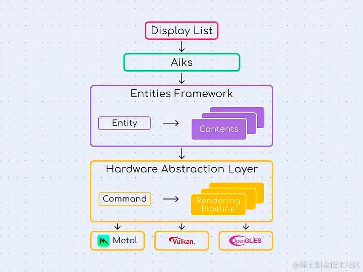

首先 Skia 肯定是一个优秀的通用 2D 图形库，例如 Google Chrome 、Android、Firefox 等设备都是用了 Skia ，
但是也因为它的「通用性」，所以它不属于 Flutter 的形状，它无法专门针对 Flutter 的要求去进行优化调整，
例如 Skia 附带的许多功能超出了 Flutter 的要求，其中一些可能会导致不必要的开销并导致渲染时间变慢，
而目前来看，Skia 的通用性给 Flutter 带来了性能瓶颈。

所以需要开发了新的渲染引擎Impeller，一个为flutter量身定做的渲染器。

Impeller核心目标：
1. 可预测的性能：在编译时离线编译所有着色器，并根据着色器预先构建 pipeline state objects。
2. 可检测：所有的图形资源（textures、buffers、pipeline state对象等）都被追踪和标记。
动画可以被捕获并持久化到磁盘而不影响渲染性能。
3. 可移植：没有与特定的渲染API相绑定，着色器编写一次并在需要时转换。
4. 使用现代图形API：大量使用（但不依赖）现代图形API（如Metal和Vulkan）的特性。
5. 有效利用并发性：可以在多线程上分发单帧工作负载。

