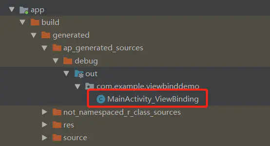
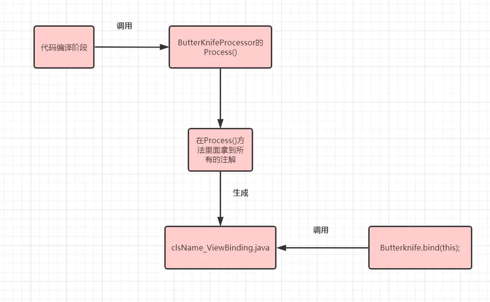

# Butterknife源码解析
如果我们频繁使用反射会导致性能比较差，那Butterknife是如何解决这个问题的呢？

## Butterknife为什么没有性能问题
源码开始解析之前，我们先来了解一下Butterknife的核心原理。在夯实基础：Java的注解中我们提到过注解的保留期。

* 源码时注解(SOURCE)：仅保留在源码阶段，在编译期就会被丢弃，一般是编译器来解析相关注解
* 编译时注解(CLASS)：保留在编译阶段，在类的加载阶段会被丢弃，一般使用**APT**技术来解析
* 运行时注解(RUNTIME)：全程保留，从源码到App运行过程中，一般使用**反射**来解析

了解了前面的知识，我们就可以知道Butterknife肯定不是用反射来解析注解的，因为反射的效率比较低，
也不是通过编译器来解析的，如果是这样的话，压根也就没有了Butterknife这个库了。
Butterknife是用APT技术来解析注解的，APT的全称是Android Annotation Processor Tool，Android注解解析工具。
它是在**编译期阶段**来解析注解并生成对应的代码，然后在使用的时候再去调生成的代码，
这样就跟我们自己写好的代码自己调用一下，不会产生任何性能问题，并且会减少大量的模板类代码。
（关注APT技术的详解我会在下一篇手撸Butterknife给大家详细介绍）

## Bnifeknife的源码解析
注意：本文做的源码分析的Butterknife版本是最新的10.2.1

```java
public class MainActivity extends AppCompatActivity {


    @BindView(R.id.tvTitle)
    TextView textView;

    @BindView(R.id.button)
    Button button;

    @Override
    protected void onCreate(Bundle savedInstanceState) {
        super.onCreate(savedInstanceState);
        setContentView(R.layout.activity_main);
        ButterKnife.bind(this);
        textView.setText("文本");
        button.setText("按钮");

    }

    @OnClick(R.id.button)
    public void testClick(){
        Toast.makeText(getApplicationContext(),"测试点击事件",Toast.LENGTH_SHORT).show();
    }
}

```
我们就先以这个简答的例子看一下，这里我们用了@BindView和@OnClick两个注解，单看这两个注解我们看不出什么，
我们直接跟到ButterKnife.bind(this);里面，最终会跟到

```
 @NonNull @UiThread
  public static Unbinder bind(@NonNull Object target, @NonNull View source) {
    Class<?> targetClass = target.getClass();
    if (debug) Log.d(TAG, "Looking up binding for " + targetClass.getName());
    Constructor<? extends Unbinder> constructor = findBindingConstructorForClass(targetClass);

    if (constructor == null) {
      return Unbinder.EMPTY;
    }

    //noinspection TryWithIdenticalCatches Resolves to API 19+ only type.
    try {
      return constructor.newInstance(target, source);
    } catch (IllegalAccessException e) {
      throw new RuntimeException("Unable to invoke " + constructor, e);
    } catch (InstantiationException e) {
      throw new RuntimeException("Unable to invoke " + constructor, e);
    } catch (InvocationTargetException e) {
      Throwable cause = e.getCause();
      if (cause instanceof RuntimeException) {
        throw (RuntimeException) cause;
      }
      if (cause instanceof Error) {
        throw (Error) cause;
      }
      throw new RuntimeException("Unable to create binding instance.", cause);
    }
  }

```
这段代码核心的就干了三件事
1.Class<?> targetClass = target.getClass(); 拿到传入的Activity的Class类对象
2.Constructor<? extends Unbinder> constructor = findBindingConstructorForClass(targetClass);寻找第一步的Class类对象的构造方法
3.return constructor.newInstance(target, source);//调用构造方法
这里我们还要从findBindingConstructorForClass(targetClass)跟进去看看他是怎么寻找的构造方法

```
@Nullable @CheckResult @UiThread
  private static Constructor<? extends Unbinder> findBindingConstructorForClass(Class<?> cls) {
    Constructor<? extends Unbinder> bindingCtor = BINDINGS.get(cls);//重点一
    if (bindingCtor != null || BINDINGS.containsKey(cls)) {
      if (debug) Log.d(TAG, "HIT: Cached in binding map.");
      return bindingCtor;
    }
    String clsName = cls.getName();
    if (clsName.startsWith("android.") || clsName.startsWith("java.")
        || clsName.startsWith("androidx.")) {
      if (debug) Log.d(TAG, "MISS: Reached framework class. Abandoning search.");
      return null;
    }
    try {
      Class<?> bindingClass = cls.getClassLoader().loadClass(clsName + "_ViewBinding");//重点二
      //noinspection unchecked
      bindingCtor = (Constructor<? extends Unbinder>) bindingClass.getConstructor(cls, View.class);
      if (debug) Log.d(TAG, "HIT: Loaded binding class and constructor.");
    } catch (ClassNotFoundException e) {
      if (debug) Log.d(TAG, "Not found. Trying superclass " + cls.getSuperclass().getName());
      bindingCtor = findBindingConstructorForClass(cls.getSuperclass());
    } catch (NoSuchMethodException e) {
      throw new RuntimeException("Unable to find binding constructor for " + clsName, e);
    }
    BINDINGS.put(cls, bindingCtor);
    return bindingCtor;
  }

```
这里需要看的地方就两个，代码里已经加了注释
重点一：BINDINGS是一个Map对象，而且是个静态常量（生命周期等同于App），
这个保证了我们如果是已经被绑定过的对象，不需要二次绑定，可以直接从Map里面取出来，主要是为了性能优化考虑。
重点二： cls.getClassLoader().loadClass(clsName + "_ViewBinding");这里以我们上面的例子为例，
clsName就等于MainActivity，这里就是用cls的类加载器去加载了一个名叫MainActivity_ViewBinding的java类，
下面我们就要找一下MainActivity_ViewBinding这个java类。上面我们提到过，
Butterknife是通过APT技术来解析注解并生成相关代码，
我们可以推断出这个MainActivity_ViewBinding这个java类就是Butterknife生成的代码，通过APT生成的代码都在如图所示目录下




APT生成的文件.png


我们点开这个文件看一下

```java
public class MainActivity_ViewBinding implements Unbinder {
  private MainActivity target;

  private View view7f070022;

  @UiThread
  public MainActivity_ViewBinding(MainActivity target) {
    this(target, target.getWindow().getDecorView());
  }

  @UiThread
  public MainActivity_ViewBinding(final MainActivity target, View source) {
    this.target = target;

    View view;
    target.textView = Utils.findRequiredViewAsType(source, R.id.tvTitle, "field 'textView'", TextView.class);
    view = Utils.findRequiredView(source, R.id.button, "field 'button' and method 'testClick'");
    target.button = Utils.castView(view, R.id.button, "field 'button'", Button.class);
    view7f070022 = view;
    view.setOnClickListener(new DebouncingOnClickListener() {
      @Override
      public void doClick(View p0) {
        target.testClick();
      }
    });
  }

  @Override
  @CallSuper
  public void unbind() {
    MainActivity target = this.target;
    if (target == null) throw new IllegalStateException("Bindings already cleared.");
    this.target = null;

    target.textView = null;
    target.button = null;

    view7f070022.setOnClickListener(null);
    view7f070022 = null;
  }
}

```
看到这里我们很多事情都会豁然开朗，首先我们回忆一下ButterKnife.bind(this);
这行代码干的核心事情是调用MainActivity_ViewBinding的构造方法，在MainActivity_ViewBinding的构造方法里面，我们干了些什么事情呢？
一行一行代码看

重点一： target.textView = Utils.findRequiredViewAsType(source, R.id.tvTitle, "field 'textView'", TextView.class);
直接点到findRequiredViewAsType这个方法里面看

```
public static <T> T findRequiredViewAsType(View source, @IdRes int id, String who,
      Class<T> cls) {
    View view = findRequiredView(source, id, who);//findViewById
    return castView(view, id, who, cls);//转型
  }

```
重点二：

```
view = Utils.findRequiredView(source, R.id.button, "field 'button' and method 'testClick'");
    target.button = Utils.castView(view, R.id.button, "field 'button'", Button.class);

```
这里为啥把重点一的一步拆分为了两步（findViewById和转型）呢，因为Button有个点击事件，
且点击事件和创建View是分开的，也就是说我不创建View也可以声明点击事件，二者没有影响
重点三：

```
view.setOnClickListener(new DebouncingOnClickListener() {
      @Override
      public void doClick(View p0) {
        target.testClick();
      }
    });

```
给button设置点击事件，最终调的是我们写的testClick()
其实这段源码没有什么可以特别解读的地方，但是我真的建议大家认真的研习一下，去感觉一下JakeWharton大神写的代码是多么的简洁且优雅。

注意：这里也解决了一个我们在使用Butterknife的疑问，就是我们使用注解的变量或者方法不能被**private**和**protected**修饰，
因为我们的target的对象要直接调用对应的变量和方法，比如 target.textView ； target.testClick();

## APT技术
前面提到了Butterknife使用了APT技术生成了MainActivity_Binding这个类，下面我简单介绍一下APT技术。
Android在编译期阶段会扫描所有继承自**AbstractProcess**的子类，并调用其中的process()方法，
我们只要在process()方法里拿到我们所有的注解并生成对应的代码即可。下面我来介绍一下AbstractProcess以及它相关的几个方法
AbstractProcessor是一个抽象类，常用的方法有四个

* init(ProcessingEnvironment processingEnv)：注解处理器的初始化，一般在这里获取我们需要的工具类
* process(Set<? extends TypeElement> annotations, RoundEnvironment roundEnv)：必须要重写的方法，
也是实际入口有点类似与main()方法，我们要在这写我们实际的业务代码
* getSupportedAnnotationTypes()：指定注解处理器是注册给哪个注解的，返回指定支持的注解类集合
* getSupportedSourceVersion()：返回支持的jdk版本，一般都直接使用SourceVersion.latestSupported();

## Butterknife中APT的应用
关于APT这里只是简单介绍一下，因为下一篇文章我会带大家手撸一个Butterknife，这里我们还是回到Butterknife的源码中来。
下面的源码分析需要大家把Butterknife的代码clone下来，找到ButterKnifeProcessor这个类。

ButterKnifeProcessor中的源码很多，这里我们只看重点，直接到process方法中

```
@Override public boolean process(Set<? extends TypeElement> elements, RoundEnvironment env) {
    Map<TypeElement, BindingSet> bindingMap = findAndParseTargets(env);//解析所有的Butterknife注解并生成一个Map对象

    for (Map.Entry<TypeElement, BindingSet> entry : bindingMap.entrySet()) {
      TypeElement typeElement = entry.getKey();
      BindingSet binding = entry.getValue();

      JavaFile javaFile = binding.brewJava(sdk, debuggable);//这里用到了JavaPoet库中的类，生成对应的java类
      try {
        javaFile.writeTo(filer);//把java类写入到文件里面
      } catch (IOException e) {
        error(typeElement, "Unable to write binding for type %s: %s", typeElement, e.getMessage());
      }
    }

    return false;
  }

```
关键的代码注释已经写好了，这里要特别提一下Butterknife内部还引入了一个Java库叫JavaPoet，
这个是专门用来编写java文件的，对JavaPoet感兴趣的小伙伴可以自行Google一下。
BindingSet这个类是对JavaPoet里面的一些属性的封装，它包含了一个Java文件里面包含的各种注解信息，由它生成java文件再写入即可。
为了方便理解，我这里再配一张流程图




butterknife流程图.png

## 总结
Butterknife不存在性能问题是利用了APT技术，在代码编译阶段就对注解做了解析并生成了相关代码，
Butterknife.bind（this）；实际上就是对生成代码的调用。关于APT技术的详细介绍和如何自定义一个注解解析器。