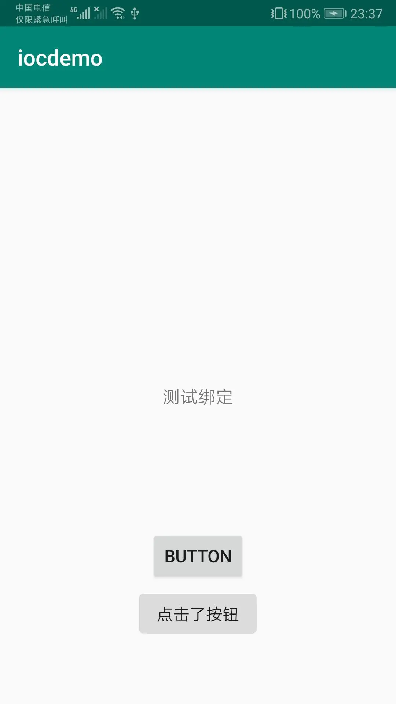

# 前言：反射和注解实现简单依赖注入框架
## 创建注解
这里我们以Butterknife的ViewBind和OnClick为例，创建这么两个注解，直接上代码

```Plain Text
@Retention(RetentionPolicy.RUNTIME)
@Target(ElementType.FIELD)
public @interface ViewBind {
    int value();
}

```
```Plain Text
@Retention(RetentionPolicy.RUNTIME)
@Target(ElementType.METHOD)
public @interface OnClick {
    int value();
}

```
这里没有什么特别要说，这两个注解需要用反射来解析，所以生命周期都要保留到RUNTIME(运行时)，一个需要作用到成员变量上，一个作用到方法上。

## 创建注解解析器
光有了注解还不行，必须要有与之对应的注解解析器来解析注解，这里我们利用反射，直接上代码

```Plain Text
public class ViewInjust {

    public static void bind(Activity activity){
        bindView(activity);
        bindClick(activity);
    }

    private static void bindView(Activity activity) {
        Class<? extends Activity> aClass = activity.getClass();//拿到class类对象
        Field[] declaredFields = aClass.getDeclaredFields();//拿到所有的成员变量
        for (Field field:declaredFields) {//遍历成员变量
            if (field.isAnnotationPresent(ViewBind.class)) {//判断该变量是否被注解
                ViewBind annotation = field.getAnnotation(ViewBind.class);//获得ViewBind
                int viewId = annotation.value();//拿到viewId
                View view = activity.findViewById(viewId);//拿到view
                try {
                    field.setAccessible(true);//取消安全检查机制
                    field.set(activity,view);//把view赋值给当前成员变量
                } catch (IllegalAccessException e) {
                    e.printStackTrace();
                }
            }
        }
    }

    private static void bindClick(final Activity activity) {
        Class<? extends Activity> aClass = activity.getClass();//拿到class类对象
        Method[] declaredMethods = aClass.getDeclaredMethods();//拿到所有的方法
        for (final Method method:declaredMethods) {//遍历所有的方法
            if (method.isAnnotationPresent(OnClick.class)) {
                OnClick annotation = method.getAnnotation(OnClick.class);//获得Onclick注解
                int viewId = annotation.value();
                View view = activity.findViewById(viewId);
                view.setOnClickListener(new View.OnClickListener() {
                    @Override
                    public void onClick(View v) {
                        try {
                            method.setAccessible(true);//取消安全检查机制
                            method.invoke(activity,null);//调用对应的方法
                        } catch (IllegalAccessException e) {
                            e.printStackTrace();
                        } catch (InvocationTargetException e) {
                            e.printStackTrace();
                        }
                    }
                });
            }
        }
    }
}

```
代码上面都有充分的注释，主要运用就是我们在第一篇中学到的反射的知识。

## 测试一下
```Plain Text
public class MainActivity extends AppCompatActivity {

    @ViewBind(R.id.textView)
    TextView textView;
    @Override
    protected void onCreate(Bundle savedInstanceState) {
        super.onCreate(savedInstanceState);
        setContentView(R.layout.activity_main);
        ViewInjust.bind(this);
        textView.setText("测试绑定");
    }

    @OnClick(R.id.button)
    private void clickBtn(){
        Toast.makeText(getApplicationContext(),"点击了按钮",Toast.LENGTH_SHORT).show();
    }
}

```
测试结果





