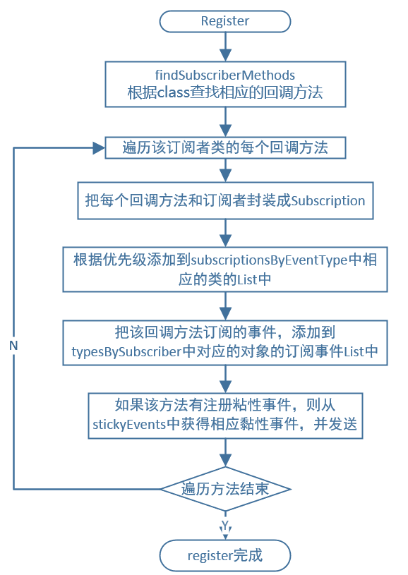
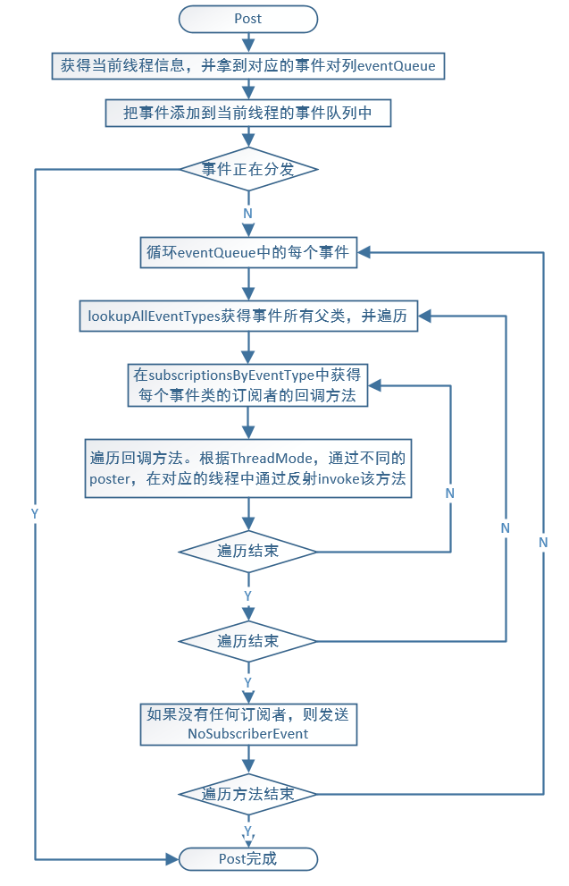
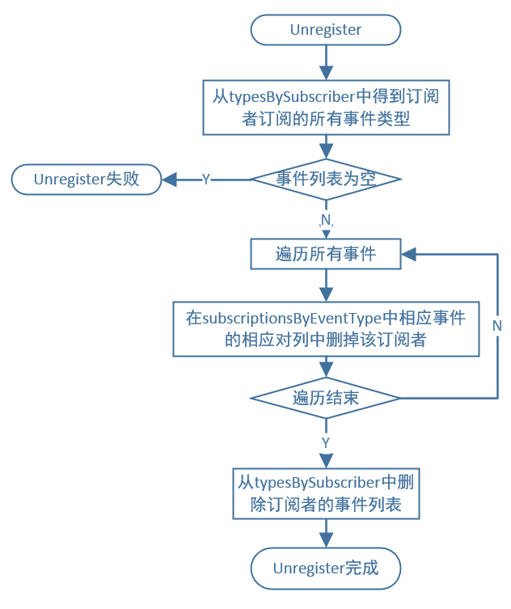

# Eventbus源码解析
### **1.构造函数**
当我们要调用EventBus的功能时，比如注册或者发送事件，总会调用EventBus.getDefault()来获取EventBus实例：

```Plain Text
public static EventBus getDefault() {
    if (defaultInstance == null) {
        synchronized (EventBus.class) {
            if (defaultInstance == null) {
                defaultInstance = new EventBus();
            }
        }
    }
    return defaultInstance;
}

```
### **2.订阅者注册**
获取到EventBus后，便可以将订阅者注册到EventBus中，下面来看一下register方法：

```Plain Text
public void register(Object subscriber) {
     Class<?> subscriberClass = subscriber.getClass();
 // 用 subscriberMethodFinder 提供的方法，找到在 subscriber 这个类里面订阅的内容。
     List<SubscriberMethod> subscriberMethods = subscriberMethodFinder.findSubscriberMethods(subscriberClass);
     synchronized (this) {
         for (SubscriberMethod subscriberMethod : subscriberMethods) {
             subscribe(subscriber, subscriberMethod);
         }
     }
 }

```
具体代码，不贴了，仍旧是通过反射拿到方法，获取注解信息，用于生成SubscriberMethod。这里有个特别之处

```Plain Text
if (ignoreGeneratedIndex) {
    subscriberMethods = findUsingReflection(subscriberClass);
} else {
    subscriberMethods = findUsingInfo(subscriberClass);
}
```
如果不是ignoreGeneratedIndex，就是如果不忽略索引，走findUsingInfo，使用索引其实就是APT提前编译注解生成代码，提前注册好了SubscriberInfoIndex的实现类。怎么配置索引，自己百度哈。



### **3.事件的发送**
在获取到EventBus对象以后，可以通过post方法来进行对事件的提交：

```Plain Text
public void post(Object event) {
     //PostingThreadState保存着事件队列和线程状态信息
      PostingThreadState postingState = currentPostingThreadState.get();
     //获取事件队列，并将当前事插入到事件队列中
      List<Object> eventQueue = postingState.eventQueue;
      eventQueue.add(event);

      if (!postingState.isPosting) {
          postingState.isMainThread = Looper.getMainLooper() == Looper.myLooper();
          postingState.isPosting = true;
          if (postingState.canceled) {
              throw new EventBusException("Internal error. Abort state was not reset");
          }
          try {
            //处理队列中的所有事件
              while (!eventQueue.isEmpty()) {
                  postSingleEvent(eventQueue.remove(0), postingState);
              }
          } finally {
              postingState.isPosting = false;
              postingState.isMainThread = false;
          }
      }
  }

```


post-->postSingleEvent-->postSingleEventForEventType-->postToSubscription，
最后调用invokeSubscriber完成回调，MAIN_ORDERED和BACKGROUND还有队列逻辑。

postSticky调用在postSingleEventForEventType会卡主，
因为subscriptionsByEventType取不到Subscription，因为没有注册过。注册过的话和post没区别。

### **4.订阅者取消注册**
```Plain Text
public synchronized void unregister(Object subscriber) {
    List<Class<?>> subscribedTypes = typesBySubscriber.get(subscriber);
    if (subscribedTypes != null) {
        for (Class<?> eventType : subscribedTypes) {
            unsubscribeByEventType(subscriber, eventType);
        }
        typesBySubscriber.remove(subscriber);
    } else {
        Log.w(TAG, "Subscriber to unregister was not registered before: " + subscriber.getClass());
    }
}

```


该处unregister失败，有异议，应该是该观察者不需要unregister，因为已经查不到注册了。