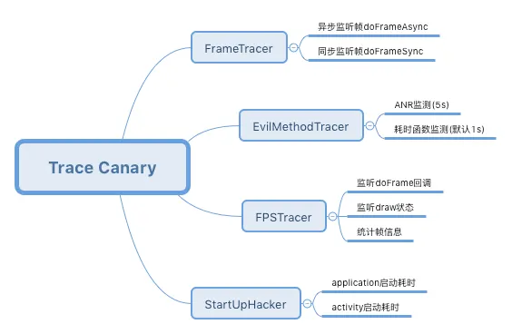

主要类如图：

利用 Choreographer 接收 VSync 信号监听每帧回调，使用反射获取帧率数据
利用 Looper 中的 Printer 对象获取事件处理前后的信息，动态代理在looper工作时打印数据

完全可以参考matrix实现自己的针对卡顿的跟踪。

FPS（每秒帧数） 低并不意味着卡顿发生，而卡顿发生 FPS 一定不高。 FPS 可以衡量一个界面的流程性，
但往往不能很直观的衡量卡顿的发生，这里有另一个指标（掉帧程度）可以更直观地衡量卡顿。

matrix的TraceCanary正是采用该方案。
