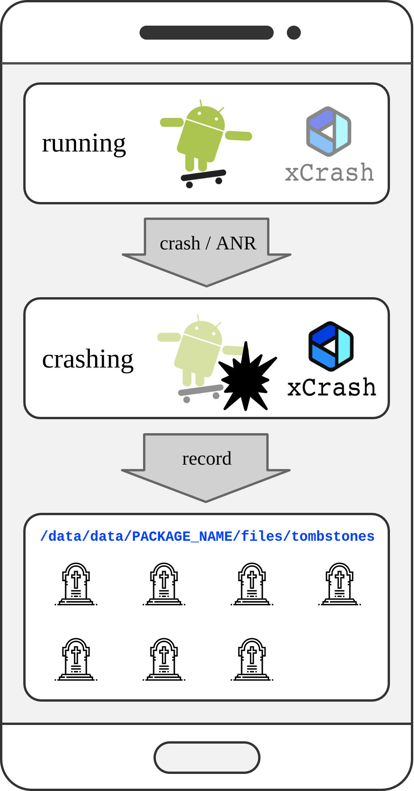

xCrash 能在 app 进程崩溃或 ANR 时，在你指定的目录中生成一个 tombstone 文件（格式与安卓系统的 tombstone 文件类似）。

### 默认配置为：

java crash、native crash 和 ANR 都会被捕获
日志目录在 /data/data/[pkg]/files/tombstones
java crash 日志文件为 tombstone_[加载 xCrash 的时间，单位为秒的时间戳，宽度为 20]_[app version]__[process name].java.xcrash
native crash 日志文件为 tombstone_[加载 xCrash 的时间，单位为秒的时间戳，宽度为 20]_[app version]__[process name].native.xcrash
ANR 日志文件为 tombstone_[加载 xCrash 的时间，单位为秒的时间戳，宽度为 20]_[app version]__[process name].trace.xcrash

### Java Crash

捕获 Java Crash 用的是 DefaultUncaughtExceptionHandler

### Native Crash

捕获 Native Crash 靠的是信号处理器（sigaction），比如说访问非法地址时，APP 进程会收到 SIGSEGV，
对应的信号处理器就可以在这个时间点收集堆栈信息

参考 https://www.dalvik.work/2021/06/22/xcrash/

